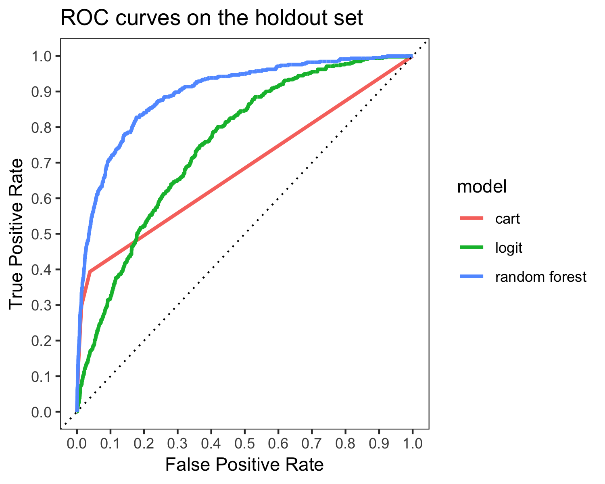
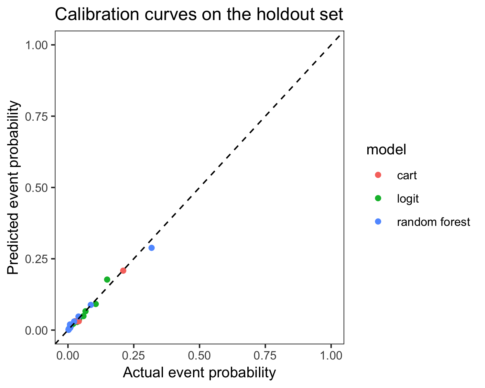
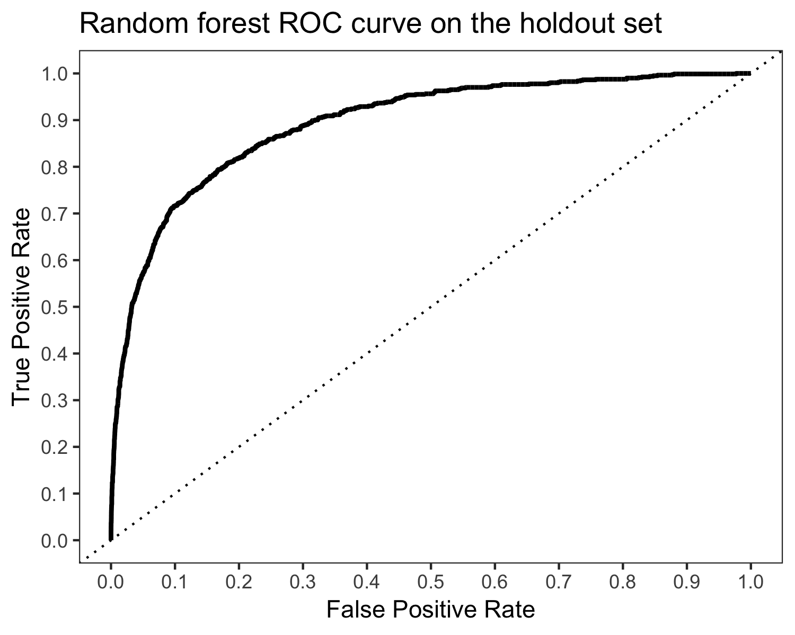
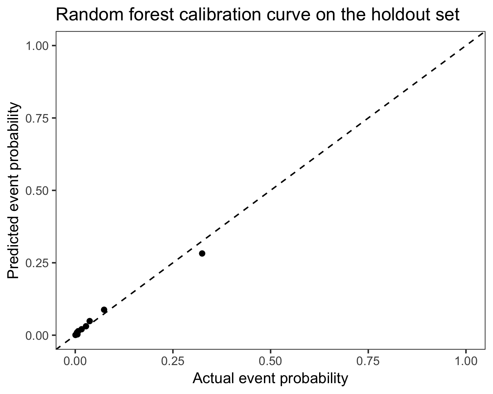

## What makes a company fast-growing and how to identify them
### A short story of finding business units with growth potential 

Identifying a fast-growing company at an early stage provides good business opportunity for investment but choosing the right growth factor can be difficult. We have at hand the Bisnode company database which provided us with 60+ variables for over 45.000+ companies for the period between 2010 and 2015.
Choosing the right growth factor greatly depends on our motives. If we are the government then probably increasing the workforce has priority over the ROI or the EBIDTA but if we are an investment fund it is probably the other way around. The list below shows the possible factors we considered in the beginning with short explanation on how we ruled about them.
*	**YoY sales growth** - skyrocketing revenue is definitely what investors would like to see but stand-alone sales numbers only doesn’t necessarily reflect on company value and it doesn’t provide an insight on the status of the company 
*	**YoY asset growth** - various reasons can be behind the growth of one company’s asset growth but alone is a poor predictor of one company’s future success
As an investment firm both revenue and assets are important for us thus using a metric that captures both seems reasonable. Furthermore, we believe that from an investor’s point of view the potential increase in the company’s value is the most important factor. Unfortunately, the information available would not be enough for a proper company valuation, but we can look at earnings before interest, taxes, depreciation and amortization or EBITDA (or in this case a close proxy), which is often used in valuing firms via EBITDA based multiples. 
Dealing with the fact that EBITDA for firms can be negative, we decided to look at how EBITDA changed over time, which change we standardized across companies through the division with the initial asset value. Since we didn’t have all necessary data to calculate the EBIDTA we decided to use EBDTA (no info about the interest) to calculate our factor which is the EBDTA-to-Asset, which has the following formula **[EBDTA (t+2)-EBDTA (t)] / Asset (t)**.
After finalizing the target factors, we decided to take care of the bottom and top 5% percentiles of the data by using the winsorizing technique to better manage the extreme values in the dataset. After the winsorization, we separate the dataset by years and also we group by the industry categories (ind_cat_2) for the creation of the growths flags, which is done via selecting companies above the 95% percentile EBDTA-to-Asset level by year and industry. Now everything is set for the modelling, for which we use a linear (LOGIT), a CART and a random forest model.

## Task A)
Based on our modelling effort the random forest model proved to be the best based on AUCs in the cross-validated data and Brier scores on the holdout set. The ROC curves and the calibration plots can be seen below. In both aspects random forest seems to be better than the other models. Our choice of the random forest model is also supported by its Brier score, which was the lowest at 0.03618 among all the models.





## Task B)
In the extra task we used the previously estimated random forest model for making predictions on the dataset with the data from 2013 to 2015. Given that our flag was based on a 2-years forward metric, this dataset had useable observations in practice only for 2013. Running the random forest model yielded similar results to the ones we got in **Task A)**. The ROC curve and the calibration plot can be seen below. The model produced an AUC of 0.8935 and Brier-score of 0.0358 on this dataset. Overall, we conclude that based on these metrics the model seems to be useful for the classification in this dataset as well.





The step-by-step details of our work can be found below.

## Setting up the environment
We start our work with setting up the environment and loading the packages used by the preparation and the modelling stages.

```{r setup, results="hide", message=F}
library(tidyverse)
library(haven)
library(Hmisc)
library(ggplot2)
library(cowplot)
library(dplyr)
library(tidyr)
library(gmodels) #crosstab
library(lspline)
library(stargazer)
library(sandwich)
library(rattle)
library(caret)
library(glmnet)
library(skimr)
library(broom)
library(purrr)
library(ROCR)
```

## Reading the data

We use the "bisnode-firms_work.csv" file, in the same format as created by the "ch17_bisnode-firms_default_dataprep_start.R" script (it is the same file found on the google drive).

```{r loading data, results="hide", message=F, warnings = F}
data_backup <- read_csv('~/Documents/CEU/DA3/bisnode-firms_work.csv')

data <- data_backup

glimpse(data) # taking an initial look at the data
```

## Label engineering part 1)

We start with creating the forward looking EBTDA to initial total assets ratio. Given that two years forward data is not available for 2014 and 2015, the observations from these years will not be part of the modelling / holdout datasets. The two years forward period should provide more stability than just one year only due to the possible annual variations. The EBTDA to total assets ratio is not annualised, given that annualisation would not change the order between observations and we are only interested in the top 5% on an ordered basis.

```{r creating measurement for flag, warning=F, error=F, message = F}
data <- data %>% mutate(ebtda = (inc_bef_tax_pl - extra_profit_loss_pl) * sales + amort) # we start with creating EBTDA from the P&L

data %>% select(year, ebtda, sales, total_assets_bs) %>% # there are more EBTDA values missing, but the difference from sales NAs is not huge
  mutate(year = as.factor(year)) %>% 
  group_by(year) %>% 
  summarise(total = n(), ebtda_na = sum(is.na(ebtda)), ebtda_na_ratio = ebtda_na/total,
            sales_na = sum(is.na(sales)), sales_na_ratio = sales_na/total,
            total_assets_na = sum(is.na(total_assets_bs)), assets_na_ratio = total_assets_na/total)

data <- data %>% group_by(comp_id) %>% mutate(t2_ebtda = lead(ebtda, 2)) # we add t+2 year EBTDA for the ratio calculation

data %>% select(year, t2_ebtda) %>% mutate(year = as.factor(year)) %>% group_by(year) %>% summarise(na = sum(is.na(t2_ebtda)), total = n(), ratio = na/total)

data <- data %>% filter(total_assets_bs > 0) # we take companies with positive assets only due to the division by assets in the ratio

data <- data %>% mutate(ebtda_to_assets = (t2_ebtda - ebtda) / total_assets_bs)

data %>% select(year, ebtda_to_assets) %>% group_by(year) %>% summarise(na = sum(is.na(ebtda_to_assets)), total = n(), ratio = na/total) 

data <- data %>% filter(is.na(ebtda_to_assets) == 0) # we take out the additional NAs 
```

## Feature engineering

In the next part we start with windsorising certain variables. We follow the same process as in "Ch17_bisnode_firms_label-engineering.R" script, as we think that it's thoroughly deals with the cases. We intend to keep EBTDA in our model, but we don't transform it given that log transformations would be difficult due to the meaningful negative values, and in the previous part we already optimised the dataset for observations with useable EBTDA values.

```{r windsorising, warning=F, error=F}
# By hand for important var                                            #
data$f_d1_sales_mil_log_low <- ifelse(data$d1_sales_mil_log< -1.5, 1, 0)
data$f_d1_sales_mil_log_high <- ifelse(data$d1_sales_mil_log>1.5, 1, 0)
data$d1_sales_mil_log_mod <- ifelse(data$d1_sales_mil_log< -1.5, -1.5, 
                                    ifelse(data$d1_sales_mil_log > 1.5, 1.5, data$d1_sales_mil_log))
data$d1_sales_mil_log_mod_sq <- data$d1_sales_mil_log_mod^2

# Winsorizing + Flags for less important                               #
# create_/- pattern. ie for 5-95% keep data as is. for low 5%, generate a single value, for top 95%, generate another one. Ie, each variable will now have two dummies

# define variable list
varlist <- list("curr_liab_bs", "fixed_assets_bs", "liq_assets_bs", "curr_assets_bs", "subscribed_cap_bs",
                "tang_assets_bs", "personnel_exp_pl", "profit_loss_year_pl", "material_exp_pl", "inventories_pl", "extra_inc_pl", "extra_exp_pl")

# define cutoffs as percentiles for winsoring --------------------------
l <- 0.05
h<- 0.95

# set space for variables & loop ---------------------------------------
floor <- c()
ceiling <- c()
reg_1 <- c()
reg_2 <- c()
mod <- c()
high <- c()
low <- c()

for(i in 1:length(varlist)){
  
  floor[i] <- quantile(data[[paste(varlist[i])]], l, na.rm = T)
  ceiling[i] <- quantile(data[[paste(varlist[i])]], h, na.rm = T)
  
  low[i] <- paste("f", varlist[i], "low", sep="_")
  high[i]<- paste("f", varlist[i], "high", sep="_")
  mod[i] <- paste(varlist[i], "mod", sep="_")
  
  data[[paste(low[i])]] <- ifelse(data[[paste(varlist[i])]] < floor[i], 1, 0)
  data[[paste(high[i])]] <- ifelse(data[[paste(varlist[i])]] > ceiling[i], 1, 0)
  data[[paste(mod[i])]] <- ifelse(data[[paste(high[i])]]==1, ceiling[i],
                                  ifelse(data[[paste(low[i])]]==1, floor[i], 
                                         ifelse(!is.na(data[[paste(varlist[i])]]), data[[paste(varlist[i])]], NA)))
  # diagnostics
  #CrossTable(data[[paste(low[i])]], data[[paste(high[i])]], prop.r=FALSE, prop.c=FALSE, prop.t=FALSE, prop.chisq=FALSE)
}
```

As a next step we select those variables that we believe can be relevant in our modelling effort. Subsequently we tackle the case of remaining NAs and adjust the dataset accordingly.

```{r further variable selection, warning=F, error=F}
data <- data %>% select(comp_id, year, status_alive, sales_mil_log, age, age2, ind, ind2_cat,
                            d1_sales_mil_log_mod, d1_sales_mil_log_mod_sq, f_d1_sales_mil_log_high, f_d1_sales_mil_log_low, 
                            ceo_young, ceo_young_flag, foreign_management, 
                            female, urban_m, matches('labor_avg'), balsheet_notfullyear,  matches('_bs'), matches('_pl'), new, 
                            ebtda, ebtda_to_assets)

to_filter <- sapply(data, function(x) sum(is.na(x)))
to_filter[to_filter > 0] # we will at the additional NAs now

data %>% group_by(year) %>% summarise(age = sum(is.na(age)) / n(), # age 2 should be the same
                                        ind = sum(is.na(ind)) / n(),
                                        d1_sales_mil_log_mod = sum(is.na(d1_sales_mil_log_mod )) / n(), # the other sales vars should be the same
                                        ceo_young_flag = sum(is.na(ceo_young_flag)) / n(),
                                        foreign_management = sum(is.na(foreign_management)) / n(),
                                        female = sum(is.na(female)) / n(),
                                        new = sum(is.na(new)) / n())

# we see that there is no singificant difference in the missing values over the years expect the CEO_young flag, so we will take that out
data <- data %>% select(-ceo_young, -ceo_young_flag)
  
data <- drop_na(data)
```

## Label engineering part 2)

We finish the preparation of the data with the creation of the labels used in the modelling as targets. The labels are created by taking the top 5% of the observations based on the EBDTA to assets metric by each year and each industry.


```{r finishing label engineering, warning=F, error=F}
data <- data %>% group_by(ind2_cat, year) %>% mutate(high_growth = ebtda_to_assets >= quantile(ebtda_to_assets, probs = 0.95))

data %>% group_by(high_growth, year) %>% summarise(count = n()) # looks okay

data %>% group_by(ind2_cat, year) %>% summarise(trues = sum(ifelse(high_growth == 1, 1, 0)), 
                                           falses = sum(ifelse(high_growth == 0, 1, 0)),
                                           share = trues / (trues + falses)) # looks okay

write.csv(data, "bisnode_final.csv")
```

## Modelling setup

We move now to the modelling phase, where we start with defining test and holdout sets, and separating the dataset for the extra task as well. Please not that the extra task dataset is names as bisnode_1315, but in practice this only contains the observations from 2013 given the two years forward looking approach and the limitations of the data available. Should we have forward looking data for 2014 and 2015 as well, the script would separate them as well.

```{r modelling setup 1, warning=F, error=F}
bisnode_final <- data %>%
  mutate(high_growth = factor(ifelse(high_growth == 0, "no", "yes"), levels = c("no", "yes"))) # we do this for the functions working accurately

bisnode_1315 <- bisnode_final %>% filter((year >= 2013) & (year <= 2015)) # we will use this dataset for the extra task, actually this is 2013 only

bisnode_1012 <- bisnode_final %>% filter(year <= 2012) # we will use this dataset for modelling

set.seed(42)
train_indices <- createDataPartition(bisnode_1012$high_growth, p = 0.8, list = FALSE) # 80/20 train/holdout
data_train <- bisnode_1012[train_indices, ]
data_holdout <- bisnode_1012[-train_indices, ]

sum(data_train$high_growth == "yes") / nrow(data_train) # the share of flagged observations is stable
sum(data_holdout$high_growth == "yes") / nrow(data_holdout) # the share of flagged observations is stable
```

## Logit models

The first group of models we use are logit models. Here the different models differ in their increasing complexity model by model.

```{r modelling logit setup, warning=F, error=F}
logit_model_1 <- c("age")
logit_model_2 <- c(logit_model_1, c("sales_mil_log", "age2", "ind", "ebtda", "d1_sales_mil_log_mod","f_d1_sales_mil_log_high", "f_d1_sales_mil_log_low", "d1_sales_mil_log_mod_sq"))
logit_model_3 <- c(logit_model_2, "female", "foreign_management", "urban_m" )
logit_model_4 <- c(logit_model_3, "labor_avg_mod", "labor_avg_flag", "balsheet_notfullyear")
logit_model_5 <- c(logit_model_4, grep("(bs|pl)_*", names(bisnode_1012), value = TRUE))

logit_models <- list(
  "logit_model_1" = logit_model_1,
  "logit_model_2" = logit_model_2,
  "logit_model_3" = logit_model_3,
  "logit_model_4" = logit_model_4,
  "logit_model_5" = logit_model_5
)

train_control <- trainControl(
  method = "cv", 
  n = 5, # 5-fold CV
  classProbs = TRUE, 
  summaryFunction = twoClassSummary  
)
```

We use the logit modelling approach from the script used in the seminar. The models are estimated fairly quickly.

```{r logit, warning=F, error=F, message=F}
sys_time_start <- Sys.time()
logit_models <- map(logit_models, ~ {
  feature_vars <- .x
  
  set.seed(100)
  train(
    formula(paste0("high_growth ~ ", paste0(feature_vars, collapse = " + "))),
    method = "glm",
    data = data_train,
    trControl = train_control
  )  
})
sys_time_end <- Sys.time()
print(difftime(sys_time_end, sys_time_start))

summary(resamples(logit_models))

best_logit <- logit_models[["logit_model_4"]] # we choose the best model
```

Based on the ROC values we decide to keep the 4th model only, given that it has the highest area under the curve.

## Cart model

We run a cart model as although we don't expect it to yield better results than the random forest, but the visualisation can help with better understanding potential factors in the potential variable selection. This model runs longer than the logits on an individual basis (we run actually 5 logits above).

```{r CART, warning=F, error=F, message = F}
sys_time_start <- Sys.time()
set.seed(100)
cart_model <- train(
  formula(paste0("high_growth ~ ", paste0(logit_model_5, collapse = " + "))), # we keep all the variables
  method = "rpart",
  data = data_train,
  trControl = train_control,
  maxdepth = 8
)  
sys_time_end <- Sys.time()
print(difftime(sys_time_end, sys_time_start))

fancyRpartPlot(cart_model$finalModel, sub = "")

resamples(list(
  "best_logit" = best_logit,
  "cart" = cart_model)
) %>% summary()
```

Based on the ROC this model is worse than the best logit model. Looking at the output decision tree, we can see that the model identifies small companies with negative results to have high growth potential.

## Random forest model

We turn now to estimating the random forest model. This model is much more time and resource intense than any of the previous models.

```{r random forest, warning=F, error=F, message = F}
tune_grid <- expand.grid(
  .mtry = c(1, 2, 3),
  .splitrule = "gini",
  .min.node.size = c(10, 20)
)

sys_time_start <- Sys.time()
set.seed(100)
rf_model <- train(
  formula(paste0("high_growth ~ ", paste0(logit_model_5, collapse = " + "))), # we keep all the variables
  method = "ranger",
  data = data_train,
  tuneGrid = tune_grid,
  trControl = train_control
)
sys_time_end <- Sys.time()
print(difftime(sys_time_end, sys_time_start))

resamples(list(
  "best_logit" = best_logit,
  "cart" = cart_model,
  "random_forest" = rf_model)
) %>% summary()
```

Not surprisingly, the random forest model yielded superior ROC to the best logit and the cart models. One way of interpreting the AUC figure is that the random forest model on average approximately 9 out of 10 times classifies observations to 1 when in reality the observation is 1. At the logit and the cart model this kind of “accuracy” is 7.6 and 7.2 times.

## ROC curves

For visual purposes now we show the ROC curves in the holdout sets.

```{r ROC, warning=F, error=F, message = F}
roc_df_logit_rf <- imap(list("logit" = best_logit, "cart" = cart_model, "random forest" = rf_model), ~ {
  model <- .x
  predicted_probabilities <- predict(model, newdata = data_holdout, type = "prob")
  rocr_prediction <- prediction(predicted_probabilities[["yes"]], data_holdout[["high_growth"]]) 
  
  tpr_fpr_performance <- performance(rocr_prediction, "tpr", "fpr")
  tibble(
    model = .y,
    FPR = tpr_fpr_performance@x.values[[1]],
    TPR = tpr_fpr_performance@y.values[[1]],
    cutoff = tpr_fpr_performance@alpha.values[[1]]
  )  
}) %>% bind_rows()

ggplot(roc_df_logit_rf) +
  geom_line(aes(FPR, TPR, color = model), size = 1) +
  geom_abline(intercept = 0, slope = 1,  linetype = "dotted", col = "black") +
  scale_y_continuous(limits = c(0, 1), breaks = seq(0, 1, .1)) +
  scale_x_continuous(limits = c(0, 1), breaks = seq(0, 1, .1)) +
  xlab("False Positive Rate") + ylab("True Positive Rate") +
  theme_bw() +
  theme(panel.grid.major = element_blank(), panel.grid.minor = element_blank()) +
  ggtitle("ROC curves on the holdout set")

ggsave("ROC.png")
```

It is visible from the plot that random forest is truly superior to the other models as it covers higher area under the curve.

## Calibration curves

Now we visualise the calibration curves to see how the models fair in accurately predicting probabilities.

```{r calibration, warning=F, error=F, message = F}
calibrator <- function(model, data_holdout, groups){
  
  predicted_default_probability_holdout <- predict(
    model, newdata = data_holdout, type = "prob"
  )[["yes"]]
  
  prediction_holdout <- prediction(predicted_default_probability_holdout, data_holdout[["high_growth"]])
  
  actual_vs_predicted <- data.frame(
    actual = ifelse(data_holdout[["high_growth"]] == "yes", 1, 0),
    predicted = predicted_default_probability_holdout
  )
  
  num_groups <- groups
  
  calibration <- actual_vs_predicted %>% 
    mutate(predicted_score_group = ntile(predicted, num_groups)) %>% 
    group_by(predicted_score_group) %>% 
    summarise(mean_actual = mean(actual), mean_predicted = mean(predicted), num_obs = n())
  
  return(calibration)
} # we use this function for the calibration plot

calibration_logit <- calibrator(best_logit, data_holdout, 10)
calibration_cart <- calibrator(cart_model, data_holdout, 10)
calibration_rf <- calibrator(rf_model, data_holdout, 10)

calibration_all <- rbind(
  calibration_logit %>% mutate(model = "logit"), 
  calibration_cart %>% mutate(model = "cart"),
  calibration_rf %>% mutate(model = "random forest")
)

ggplot(calibration_all,
       aes(x = mean_actual, y = mean_predicted, color = model)) +
  geom_point() +
  geom_abline(intercept = 0, slope = 1, linetype = "dashed") +
  labs(x = "Actual event probability", y = "Predicted event probability") +
  ylim(0, 1) + xlim(0, 1) +
  theme_bw() +
  theme(panel.grid.major = element_blank(), panel.grid.minor = element_blank())  +
  ggtitle("Calibration curves on the holdout set")

ggsave("calibration_plot.png")
```

The calibration plot is a helpful tool for identifying how accurate the model is depending on the different buckets of probability. The closer the dots to the 45-degree line the better. The above calibration curves show us that the models are actually well calibrated, we can see some minor deviation for logit close to the 0.25 probability and in the random forest above 0.25 probability. 

## Brier scores

Finally we estimate the Brier scores as well, in order to get a score type of value for prediction accuracy in terms of the distance in actual and predicted probabilities.

```{r brier scores, warning=F, error=F, message = F}
brier_score <- function(model, data_holdout){
  predicted_default_probability_holdout <- predict(
    model, newdata = data_holdout, type = "prob"
  )[["yes"]]
  
  actual_vs_predicted <- data.frame(
    actual = ifelse(data_holdout[["high_growth"]] == "yes", 1, 0),
    predicted = predicted_default_probability_holdout
  )
  
  RMSE(actual_vs_predicted[["predicted"]], actual_vs_predicted[["actual"]])^2
} # we use this function for getting the Brier scores

brier_score(best_logit, data_holdout)
brier_score(cart_model, data_holdout)
brier_score(rf_model, data_holdout)
```

The Brier scores shows us that the pecking order is random forest, cart, and the best logit from best to worse, although the differences are fairly minor. Based on the ROC estimated on the test sample and the Brier score estimated on the holdout set, we decide to choose the random forest model as our best model.

## Extra task

We estimate the extra task with our random forest model on the holdout set with the data from 2013. We do the ROC curve, the calibration plot, and the calculation of the Brier score at the same code chunk.

```{r extra, warning=F, error=F, message = F}
roc_df_logit_rf <- imap(list("random forest" = rf_model), ~ {
  model <- .x
  predicted_probabilities <- predict(model, newdata = bisnode_1315, type = "prob")
  rocr_prediction <- prediction(predicted_probabilities[["yes"]], bisnode_1315[["high_growth"]]) 
  
  tpr_fpr_performance <- performance(rocr_prediction, "tpr", "fpr")
  tibble(
    model = .y,
    FPR = tpr_fpr_performance@x.values[[1]],
    TPR = tpr_fpr_performance@y.values[[1]],
    cutoff = tpr_fpr_performance@alpha.values[[1]]
  )  
}) %>% bind_rows()

predicted_default_probability_holdout_1315 <- predict(
  rf_model, newdata = bisnode_1315, type = "prob"
)[["yes"]]

prediction_holdout_rf <- prediction(predicted_default_probability_holdout_1315, bisnode_1315[["high_growth"]])
auc_holdout_rf <- performance(prediction_holdout_rf, measure = "auc")@y.values[[1]]
auc_holdout_rf

ggplot(roc_df_logit_rf) +
  geom_line(aes(FPR, TPR), size = 1) +
  geom_abline(intercept = 0, slope = 1,  linetype = "dotted", col = "black") +
  scale_y_continuous(limits = c(0, 1), breaks = seq(0, 1, .1)) +
  scale_x_continuous(limits = c(0, 1), breaks = seq(0, 1, .1)) +
  xlab("False Positive Rate") + ylab("True Positive Rate") +
  theme_bw() +
  theme(panel.grid.major = element_blank(), panel.grid.minor = element_blank()) +
  ggtitle("Random forest ROC curve on the holdout set")

ggsave("ROC_extra.png")

calibration_rf <- calibrator(rf_model, bisnode_1315, 10)

ggplot(calibration_rf,
       aes(x = mean_actual, y = mean_predicted)) +
  geom_point() +
  geom_abline(intercept = 0, slope = 1, linetype = "dashed") +
  labs(x = "Actual event probability", y = "Predicted event probability") +
  ylim(0, 1) + xlim(0, 1) +
  theme_bw() +
  theme(panel.grid.major = element_blank(), panel.grid.minor = element_blank()) +
  ggtitle("Random forest calibration curve on the holdout set")

ggsave("calibration_extra.png")

brier_score(rf_model, bisnode_1315)
```

The random forest model yields an AUC of 0.8935 on this dataset compared to the mean of 0.9000 on the cross-validated dataset, which is very close. The calibration plot also looks similar, with underpredicting observations above 0.25 actual probability. The Brier-score of 0.0358 compares to 0.03618 on the original holdout set, which means that considering the distances between actual and predicted probabilities are predictions are even better than on the original holdout set.